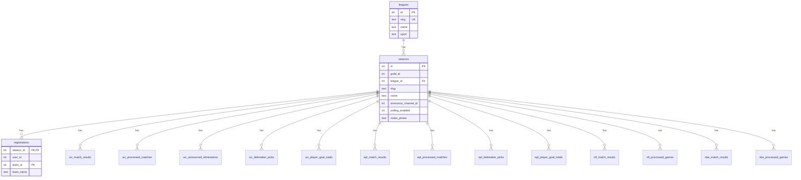

# Database schema

SQLite persistence for Discord prediction seasons. A **season** is one Discord guild tracking one league competition; all gameplay data is scoped by `season_id`.

## Entities

### Catalog

- **League** — Sport catalog entry (`wc`, `epl`, `nba`, `nfl`). Seeded on fresh schema init. Every catalog slug with a `League` variant is playable.

### Guild configuration

- **Season** — One guild’s tracking of a league competition (`guild_id`, `league_id`, slug, name, announce channel, `polling_enabled`, `roster_phase`). `polling_enabled` marks the season live: the poller processes it and gameplay commands resolve to it (`season::resolve`). `/season start` keeps at most one live season per league per guild. `roster_phase` is `open` | `drafting` | `frozen` for claim/draft gating. There is no per-guild default season.
- **Draft session / participants** — Pre-season draft order (`draft_sessions`, `draft_participants`) scoped by `season_id`.

### Gameplay (per season)

- **Registration** — A user claims a team in a season. One owner per team (`season_id`, `team_id`). The team name is stored on the row; there is no separate team table.
- **Match result** — Finished game scores and metadata (`wc_match_results`, `epl_match_results`, `nfl_match_results`, `nba_match_results`).
- **Processed flag** — Idempotency marker for games the poller already announced and scored (`wc_processed_matches`, `epl_processed_matches`, `nfl_processed_games`, `nba_processed_games`).
- **Announced elimination** — Idempotency marker for teams the poller already posted as eliminated (`wc_announced_eliminations`).
- **Tiebreaker pick** — One player pick per user per season for standings tie-breaks (`wc_tiebreaker_picks`, `epl_tiebreaker_picks`). NFL and NBA have no tie-breaker and no tie-breaker tables.
- **Player stat total** — Cached player stats for tie-breakers (`wc_player_goal_totals`, `epl_player_goal_totals`). Keyed by `(season_id, player_id)`.

World Cup, Premier League, NFL, and NBA accessors live under `db/wc/`, `db/epl/`, `db/nfl/`, and `db/nba/`. Same-shape tables (`*_processed_matches`, `*_tiebreaker_picks`, `*_player_goal_totals`) are generated from `league_macros.rs`; `match_result` is hand-written per league, as are the NFL/NBA `processed_game` accessors whose `game_id` column differs. Tables are added when a league is implemented, not ahead of time.

## Relationships

